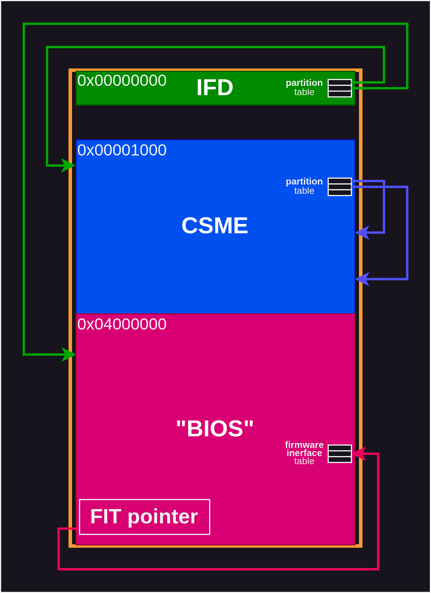

# Intel platforms

Over the years and decades, Intel has developed many hardware platforms[^14].

Since the 4-bit 4004 in 1971, they have progressed over 8-bit up to 64-bit
systems, retaining a lot of backwards compatibility. Starting with the ICH7
based platforms, Intel introduced their AMT (Active Management Technology)[^15],
an out-of-band management solution[^1] for remote provisioning and support.

AMT evolved with more features over time, carrying the vPro label for machines
targeting the business market[^16] and finally converging with more security
features such as Boot Guard[^2], Intel's secure boot implementation, digital
content protection (DRM), and more.

Now running on a coprocessor called the (Converged Security and) Manageability
Engine[^3], or (CS)ME for short, henceforth abbreviated as _ME_, a full second
operating system of its own is backing the platform.

## Boot flow

The ME has its own firmware and bootstraps an Intel platform[^19]. The main x86
cores are held in reset until the ME releases them to boot with their own
firmware.

Both the ME firmware and the main x86 firmware are stored in the same flash part
on a mainboard, partitioned via the Intel Flash Descriptior (IFD).

The following diagram is based on knowledge from various sources, including the
[coreboot documentation on Intel](https://doc.coreboot.org/soc/intel/fit.html).

The boot flow for trusted boot is documented publicly[^17] by Intel.

## ME classification and security

Security researchers have analyzed the ME[^18] and divided hardware variants
into 3 generations[^4] thus far, each with their own multiple firmware versions,
including security patch releases[^5][^6].
One core aspect in security research has been Boot Guard[^7][^8], which had
been introduced with Haswell, Intel's 4th generation Core series platforms[^10],
and discussed in the coreboot community[^11].

Note that the ME generations roughly correspond with the overall platform, in
that ranges of Intel platforms are expected to carry a certain ME hardware
generation and specific platforms a certain firmware version range.

## Processor names

Intel publicly documents how to interpret procesor names[^12] and what their
suffixes mean[^13].

## Abbreviations

| abbr.     | expansion                                   |
| --------- | ------------------------------------------- |
| ACM       | Authenticated Code Module                   |
| AMT       | Active Management Technology                |
| CSME      | Converged Security and Manageability Engine |
| DAL       | Dynamic Application Loader                  |
| FIT       | Firmware Interface Table                    |
| FPT       | Firmware Partition Table                    |
| HAP       | High-Assurance Platform                     |
| {I,M,P}CH | {I/O,Memory,Platform} Controller Hub[^9]    |
| IFD       | Intel Flash Descriptor                      |
| PTT       | Platform Trust Technology                   |
| RBE       | ROM Boot Extensions (part of ME firmware)   |
| SPS       | Server Platform Services                    |
| TXE       | Trusted Execution Engine                    |
| TXT       | Trusted Execution Technology                |

### Ambiguities

There are colliding acronyms, even within this domain.
The following abbreviations have a second meaning:

- FIT: _Flash Image Tool_ (sometimes also called _FITC_)
- FPT: _Flash Programming Tool_

[^1]: <https://www.amplicon-usa.com/actions/viewDoc.cfm?doc=iAMT-white-paper.pdf>
[^2]: <https://edc.intel.com/content/www/us/en/design/ipla/software-development-platforms/client/platforms/alder-lake-desktop/12th-generation-intel-core-processors-datasheet-volume-1-of-2/010/boot-guard-technology/>
[^3]: <https://i.blackhat.com/USA-19/Wednesday/us-19-Hasarfaty-Behind-The-Scenes-Of-Intel-Security-And-Manageability-Engine.pdf>
[^4]: <https://papers.put.as/papers/firmware/2014/2014-10_Breakpoint_Intel_ME_-_Two_Years_Later.pdf>
[^5]: <https://www.intel.com/content/www/us/en/support/articles/000029389/software/chipset-software.html?wapkw=csme>
[^6]: <https://www.intel.com/content/www/us/en/support/articles/000055675/technologies.html?wapkw=csme>
[^7]: <https://prohoster.info/en/blog/administrirovanie/doverennaya-zagruzka-shryodingera-intel-boot-guard>
[^8]: <https://github.com/flothrone/bootguard>
[^9]: <https://en.wikipedia.org/wiki/Intel_Hub_Architecture>
[^10]: <https://web.archive.org/web/20201129154607/https://www.intel.com/content/dam/www/public/us/en/documents/product-briefs/4th-gen-core-family-mobile-brief.pdf>
[^11]: <https://web.archive.org/web/20230322090345/https://patrick.georgi.family/2015/02/17/intel-boot-guard/>
[^12]: <https://www.intel.com/content/www/us/en/processors/processor-numbers.html>
[^13]: <https://www.intel.com/content/www/us/en/support/articles/000058567/processors/intel-core-processors.html>
[^14]: <https://en.wikipedia.org/wiki/List_of_Intel_processors>
[^15]: <https://en.wikipedia.org/wiki/Intel_AMT_versions>
[^16]: <https://www.intel.com/content/www/us/en/architecture-and-technology/vpro/overview.html>
[^17]: <https://www.intel.com/content/www/us/en/developer/articles/technical/software-security-guidance/resources/key-usage-in-integrated-firmware-images.html>
[^18]: <https://bitkeks.eu/blog/2017/12/the-intel-management-engine.html>
[^19]: <https://www.intel.com/content/dam/www/public/us/en/security-advisory/documents/intel-csme-security-white-paper.pdf>
