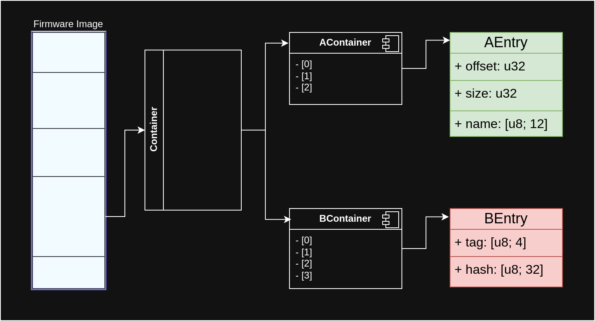

# Unpacking Firmware

Firmware images are typically packed and consist of various pieces henceforth
called _components_. In different places, they may be called more specific
terms, such as partitions, directories, modules, files, etc.

Many components are _containers_, which in turn are comprised of other things.
As it happens over time, a firmware image for a platform of today may look very
different from one meant for a platform from the past. It may be, however, that
the target platform cannot be recognized right away, making analysis harder.
Such is the case for Intel. We thus need an [architecture](./architecture.md)
that is able to distinguish at any given level and allows for extraction.

## Partitions

The following diagram is a generic example of a partitioned firmware image with
a container that may be of either one or another kind.
And in turn, it would contain one or another kind of entries.



In Rust, we can use `enum` types to express this:

```rs
enum Container {
    AContainer(Vec<AEntry>),
    BContainer(Vec<BEntry>),
}
```

## Intel ME Generation 3

With the third hardware generation of Intel ME based platforms, a new operating
system was introduced, based on MINIX 3. It needs bootstrapping first.

There are multiple kinds of partitions, including Code Partition Directory (CPD)
partitions. Those contain executables, their corresponding metadata files, and a
manifest that holds a signature over the manifest.

The signed data in the manifest includes hashes of the metadata files and other
things, so that the manifest suffices to verify the entire CPD's integrity.
Each metadata file contains the counterpart binary's hash.
The binaries themselves are mostly compressed, commonly using LZMA and a few via
Huffman encoding.

Knowledge on CPDs, manifests, metadata and binaries can be found in PT Research
utilities for unpacking:

- <https://github.com/ptresearch/unME11>
- <https://github.com/ptresearch/unME12>
